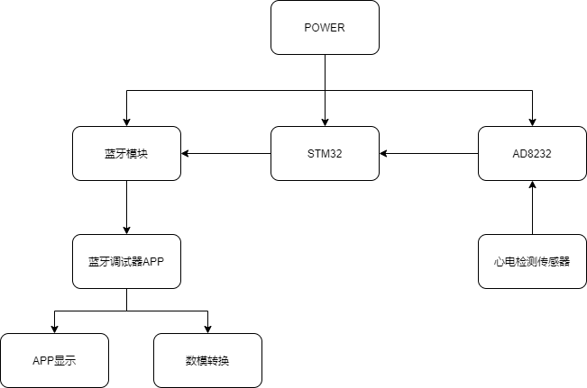

# ECGSignalAcquisitionAndDisplay

Project for Embedded Advanced Experiment.

### 一、实验目的

+ 掌握嵌入式程序设计流程。

+ 进一步熟悉并掌握嵌入式软件开发，如GPIO端口配置，蓝牙模块的使用，ADC模数转换。

+ 掌握AD8232模块的使用。

+ 编写程序画出心电图，并通过手机APP显示。

  

### 二、实验设备

+ PC机

+ keil5

+ 开发板STM32

+ AD8232模块

+ 蓝牙模块

  

### 三、实验原理

+ 实验系统框图

  

+ 实验流程图

  

  