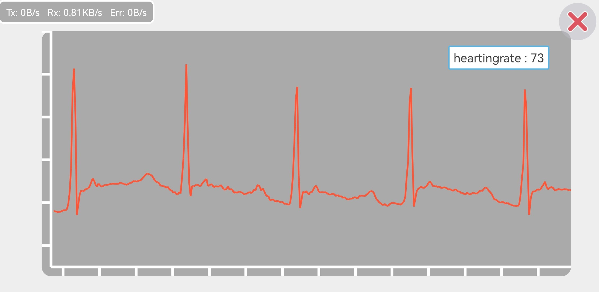

## 								<center>心电信号采集显示实验报告</center>


<h5>
    <center>2021-7-19 </center>  
</h5>             


##### 

##### <center>郭嘉哲   3190101002</center>


##### <center>梁毅浩   3190104716  </center>


##### <center>余丛杉   3190103165</center>


### 一、实验目的

+ 掌握嵌入式程序设计流程。

+ 进一步熟悉并掌握嵌入式软件开发，如GPIO端口配置，蓝牙模块的使用，ADC模数转换。

+ 掌握AD8232模块的使用。

+ 编写程序画出心电图，并通过手机APP显示。

  

### 二、实验设备

+ PC机

+ keil5

+ 开发板STM32

+ AD8232模块

+ 蓝牙模块

  

### 三、实验原理

+ 实验系统框图

  


+ 实验流程图

  

+ AD8232芯片

  ​	AD8232是一款集成前端，适用于对心脏生物电信号进行信 号调理来进行心率监护。它内置一个专用仪表放大器 (IA)、一个运算放大器(A1)、一个右腿驱动放大器(A2)和 一个中间电源电压基准电压缓冲器(A3)。此外，AD8232内 置导联脱落检测电路和一个自动快速恢复电路，该电路可 在导联重新连接后迅速恢复信号。 AD8232集成专用仪表放大器，可放大ECG信号，同时抑制 的电极半电池电位。这是通过间接电流反馈架构实现的， 与传统方案相比，该架构还能减小尺寸和降低功耗。

+ ADC转换原理

  ​	模拟信号转换成数字信号的电路，称为模数转换器(ADC)，A/D转换的作用是将时间连续、幅值也连续的模拟量转换为时间离散、幅值也离散的数字信号，因此，A/D转化需要经过取样、保持、量化及编码四个过程。在实际电路中，有些过程是并行的，例如，取样和保持，量化和编码一般都是在转换过程中同时实现的。

  ​	ADC转换器的分辨率，是指对于允许范围内的模拟信号，输出离散数字信号值的个数。这些信号值通常用二进制数存储，因此分辨率经常用比特作为单位，且这些离散值的个数是2的幂指数。例如，一个具有8位分辨率的模拟数字转换器可以将模拟信号编码成256(2^8)个不同的离散值，从0到255（即无符号整数）或从-128到127（即带符号整数），至于使用哪一种，则取决于具体的应用。

  ​	常用的ADC有积分型、逐次逼近型、并行比较型/串并行型，Σ-Δ调制型、电容阵列逐次比较型及压频变换型：

  + 积分型(如TLC7135) 。积分型ADC工作原理是将输入电压转换成时间或频率,然后由定时器/计数器获得数字值。其优点是用简单电路就能获得高分辨率,但缺点是由于转换精度依赖于积分时间,因此转换速率极低。初期的单片ADC大多采用积分型,现在逐次比较型已逐步成为主流。双积分是一种常用的AD 转换技术,具有精度高,抗干扰能力强等优点。但高精度的双积分AD芯片,价格较贵,增加了单片机系统的成本。
  + 逐次逼近型(如TLC0831) 。逐次逼近型AD由一个比较器和DA转换器通过逐次比较逻辑构成,从MSB开始,顺序地对每一位将输入电压与内置DA转换器输出进行比较,经n次比较而输出数字值。其电路规模属于中等。其优点是速度较高、功耗低,在低分辨率( < 12位)时价格便宜,但高精度( > 12位)时价格很高。
  + 并行比较型/串并行比较型(如TLC5510) 。并行比较型AD采用多个比较器,仅作一次比较而实行转换,又称FLash型。由于转换速率极高, n位的转换需要2n - 1个比较器,因此电路规模也极大,价格也高,只适用于视频AD 转换器等速度特别高的领域。串并行比较型AD结构上介于并行型和逐次比较型之间,最典型的是由2个n /2位的并行型AD转换器配合DA转换器组成,用两次比较实行转换,所以称为Halfflash型。
  + Σ-Δ调制型(如AD7701) 。Σ- Δ型ADC以很低的采样分辨率( 1位)和很高的采样速率将模拟信号数字化,通过使用过采样、噪声整形和数字滤波等方法增加有效分辨率,然后对ADC输出进行采样抽取处理以降低有效采样速率。Σ-Δ型ADC的电路结构是由非常简单的模拟电路和十分复杂的数字信号处理电路构成。
  + 电容阵列逐次比较型。电容阵列逐次比较型AD在内置DA转换器中采用电容矩阵方式,也可称为电荷再分配型。一般的电阻阵列DA转换器中多数电阻的值必须一致,在单芯片上生成高精度的电阻并不容易。如果用电容阵列取代电阻阵列,可以用低廉成本制成高精度单片AD转换器。最近的逐次比较型AD转换器大多为电容阵列式的。
  + 压频变换型(如AD650) 。压频变换型是通过间接转换方式实现模数转换的。其原理是首先将输入的模拟信号转换成频率,然后用计数器将频率转换成数字量。从理论上讲这种AD的分辨率几乎可以无限增加,只要采样的时间能够满足输出频率分辨率要求的累积脉冲个数的宽度。其优点是分辨率高、功耗低、价格低,但是需要外部计数电路共同完成AD转换。

+ 蓝牙传输的原理

  ​	蓝牙系统采用分散式（SCAtter）结构，设备间构成微微网（Piconet），支持点对点和点对多点通信。采用GFSK调制。抗干扰性能好，通过快速跳频和短包技术来减少同频干扰，保证传输的可靠性。使用的频段为无需申请许可的2.4GHz的ISM频段。

  ​	蓝牙协议从协议来源大致分为四部分：核心协议、电缆替代协议(RFCOMM)、电路控制协议和选用协议。核心协议为蓝牙专利协议，完全由蓝牙SIG开发，包括基带协议（BB）、连接管理协议（LMP）、逻辑链路控制和适配协议（$L_2$CAP）以及服务发现协议（SDP）。蓝牙协议从体系结构又可分为底层硬件模块、中间协议层和高端应用层三大部分，其中链路管理层（LM）、基带（BB）和射频层（RF）构成蓝牙的底层模块、由此可见，基带层是蓝牙协议的重要组成部分。

  ​	蓝牙数据传输：蓝牙支持电路和分组交换，数据以分组形式在信道中传输，并使用流控制来避免分组丢失和拥塞。为确保分组包数据正确传输，还进行数据的白化和纠错。

  ​	蓝牙连接设备：蓝牙链接控制器工作在两种主要状态：待令（Standby）和连接（Connection）。在蓝牙设备中，Standby是缺省的低功率状态，只运行本地时钟且不与任何其他设备交互。在连接状态，主节点和从节点能交换分组包进行通信，所以要实现蓝牙设备之间的交互，彼此必须先建立连接 。由于蓝牙使用的ISM频带是对所有无线电系统都开放的频带，会遇到各种各样的干扰源，所以蓝牙采用分组包快速确认技术和跳频方案来确定链路和信道的稳定。在建立连接和通信过程中使用跳频序列作为物理信道，跳频选择就是选择通信的信道。

+ 实验方案：

  + 人体心电经过AD8232放大滤波；
  + 再将此模拟量发送到STM32的GPIOA1脚；
  + 在STM32中进行模数转换，经GPIOA9接入蓝牙模块进行通信；
  + 在蓝牙调试器APP进行数模转换，显示波形图。

  

### 四、实验内容

+ ##### 实验程序

  + 通信模块

    + USART初始化

    + 数据切分，转换为byte进行传输

      ```c
      void Float_to_Byte(float f,uint8_t *byte)
      {
      
      	unsigned long longdata = 0;
      	longdata = *(unsigned long*)&f;          
      	byte[3] = (longdata & 0xFF000000) >> 24;
      	byte[2] = (longdata & 0x00FF0000) >> 16;
      	byte[1] = (longdata & 0x0000FF00) >> 8;
      	byte[0] = (longdata & 0x000000FF);
      
      }
      
      int ble_send(uint8_t *data,int len)
      {
        for(k=0;k<USART_TX_LEN;k++)
      	{
      		USART_SendData(USART1,(u8)USART_TX_BUF[k]);	
      		while(USART_GetFlagStatus(USART1,USART_FLAG_TC) != SET);
      	}
      	return 0;
      }
      
      void send(float vol, float heartrate)
      {
      	USART_TX_BUF[0] = 0xA5;
      	Float_to_Byte(vol,&USART_TX_BUF[1]);
      	Float_to_Byte(heartrate,&USART_TX_BUF[5]);
      	USART_TX_BUF[9]=(uint8_t) ((USART_TX_BUF[1]+USART_TX_BUF[2]+USART_TX_BUF[3]+USART_TX_BUF[4]+USART_TX_BUF[5]+USART_TX_BUF[6]+USART_TX_BUF[7]+USART_TX_BUF[8])&0xff);
      	USART_TX_BUF[10] = 0x5A;
      	
      	ble_send(USART_TX_BUF,USART_TX_LEN);
      }
      ```

      

  + 模数转换模块

    + ADC初始化
    + 使能指定的ADC1的软件转换

  + 心率计算模块

    + 上升沿触发，当波形电压第一次高于3V，计数一次，并进行定时器计时

    + 将近十次触发的时间存入数组`historytime[]`

    + 近十次的心率取平均值，即得到最终结果

      ```c
      if(vol>2.5 && flag == 0)	// 波形第一次高于3
      {
          cnt++;
          flag = 1;
          historytime[cnt] = time;
          flagtime = time;
      
          if(cnt>=10)
          {
              for(k=0;k<9;k++)
              {
                  historytime[k] = historytime[k+1];
              }
              historytime[9] = time;
              cnt = 9;
          }
          if(cnt<=3) timeaverage = (historytime[cnt] - historytime[0])/cnt;
          else if(cnt>3) timeaverage = 0.5*(historytime[cnt]-historytime[cnt-1])+0.3*(historytime[cnt-1]-historytime[cnt-2])+0.2*(historytime[cnt-2] - historytime[0])/(cnt-2);	 
          heartingrate = (int)(60*1000/timeaverage);
      
      }  
      
      if(vol<2.5 && flag == 1)
      {
          flag = 0;
      }
      
      if((time-flagtime)>5*1000)  
      {
          historytime[0] = flagtime+5*1000;
          for(k=1; k<10; k++)
              historytime[k] = 0; 
          cnt = 0;
          heartingrate = 0;
      }
      		
      ```

      

+ ##### 实验现场


​	


### 五、实验总结

+ ##### 实验结果与分析

  蓝牙调试器APP显示心电图：

  

  由图可知，我们得到的心电波形质量较高，测量心率得73次/分。

+ ##### 讨论、心得

  ​	本次实验的通讯部分主要参考网络资料、结合自己发送的数据完成配置即可。心率计算部分的思路是测量两次峰值时间进行计算，设立flag变量、结合vol值判断是否达到触发条件，若达到则将当前时间写入计时数组，为了节约内存和并保证代码的简洁性。我们将数组设为实时更新的数组，只保留最近10次触发的时间数据，用于计算心跳的平均时间间隔。为了保证实时性和准确性，最近三次触发的时间的间隔应占更大的权重。最后利用平均时间间隔算出心率，即1分钟触发次数。如果连续5s没有触发，则心率为0。这些设定是在一点点调试、参考现实心率测量仪得到的，但我们尚未知道现实心率测量仪的测量原理，仍存在一些不足，如只有触发时才会更新心率，长时间不触发无法更新心率。而且由于权重是在自己定义的，只能让得到的心率变化的实时性更强，但准确性尚未得到证实。

  ​	本次调试心电模块，我们主要实现了心电数据在单片机上的AD转换，并通过串口输出到蓝牙通讯。AD转换的过程比较顺利，但蓝牙的调试过程遇到了一些困难。其中最大的问题是我们只能通过电脑的串口获得通讯数据值，但无法通过蓝牙将串口数据传输到手机上，但是此时手机上输入的值可以通过蓝牙传输到单片机中并通过串口在电脑上显示，在电脑上进行输入也能得到同样的结果，最后发现是手机app上通讯数据包格式不匹配的原因，我们通过参考网上的资料，通过手动设置来发送数据包，并在手机app蓝牙调试器上实现了正常的波形显示。在观测波形的过程中，我们发现初步得到的波形效果并不好，只能显示RS部分，对于PQTU的部分都难以观测，在通过调整AD采样间隔和取平均值的次数，并且解决接触问题后，基本能够正常显示心电图各个要素。
  由于身体机能的差异，我们组其中一个同学在正常接线后，波形图甚至不能正常显示，换了个同学就可以正常使用，这也给我们带来了不少欢乐。

  ​	 整个程序比较巧妙的点有触发条件的判断、时间数组的更新等，在不断的调试中得到了比较完美的结果，是对我们的锻炼。